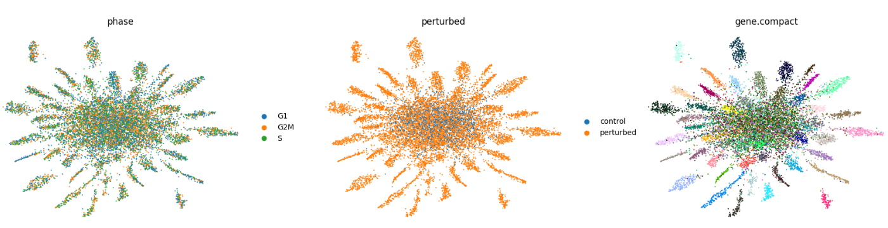
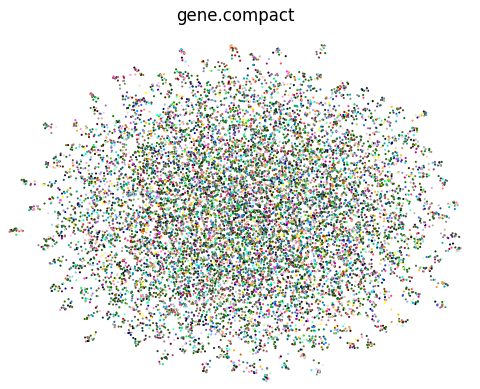

perturbseq的数据在分析的时候，发现所有的细胞（敲除的、没敲除的）在umap上混在一起。本来期待的敲除对细胞造成的表达量的影响，却不是最终观测到的最大的差别，那么这些差别是什么呢？

细胞周期的影响
---
细胞系在培养的时候，细胞处于不同的细胞周期阶段，细胞周期的差异，是细胞背景差异的原因之一。

细胞的异质性
---
因为使用的是细胞系，细胞系中细胞之间的差异可能比较大，尤其是在实验过程中，添加实验条件之后连续培养多天，经过这段时间的增殖之后，组内细胞之间的差异可能会更大。

深度学习的方法去除
---
目前看见的两个方法
1. contrastiveVI(使用变分自编码器，学习none-perturbed control cell的内部差异作为背景，在细胞间的比较时去除该差异)
2. scCAPE(使用变分自编码器，学习none-perturbed control cell的内部差异作为背景，在细胞间的比较时去除该差异)

最近看了contrastiveVI的核心代码。contrastiveVI基于scVI的框架，其中decoder的部分是直接使用的scVI库中的decoder类。我们可以从scVI和contrastiveVI的文章看出来，这两种方法都是基于零膨胀负二项分布的单细胞counts数据生成模型。scVI的教程中有使用pyro构建新模型的部分，因此，我也尝试了一下使用pyro框架进行contrastiveVI的复现。以下是代码，除了reconstruction loss, KL loss之外，对于mean encoder的值进行了正则化，提升训练的稳定性。目前只写了训练过程，还有一些功能没有写，包括对于latent variable的获取和处理，以及生成的过程。

```python

import pyro
import scanpy as sc
from scanpy import AnnData
import scvi
import torch
import torch.nn as nn
import numpy as np
import pyro.distributions as dist 
import pyro.poutine as poutine
from torch.distributions import constraints
import pandas as pd
import pyro
from pyro.infer import SVI, Trace_ELBO
from pyro.optim import Adam
from torch.utils.data import  DataLoader
import scipy
torch.set_default_tensor_type(torch.DoubleTensor)

CUDA_VISIBLE_DEVICES=1
torch.cuda.set_device(1)


if torch.cuda.is_available():
    print("Using GPU")
    torch.set_default_tensor_type("torch.cuda.DoubleTensor")
else:
    print("Using CPU")
    torch.set_default_tensor_type("torch.DoubleTensor")

def make_fc(dims):
    layers = []
    for in_dim, out_dim in zip(dims, dims[1:]):
        layers.append(nn.Linear(in_dim, out_dim))
        #layers.append(nn.BatchNorm1d(out_dim))
        layers.append(nn.ReLU())
    return nn.Sequential(*layers[:-1])  # Exclude last ReLU

class FCNN(nn.Module):
    def __init__(self, n_input, n_output, n_hidden,transformer=None):
        super(FCNN, self).__init__()
        self.dims = [n_input] + [n_hidden] + [n_output]
        self.fc = make_fc(self.dims)
        if transformer is not None:
            self.transformer = transformer
        else:
            self.transformer = None
    def forward(self, x):
        x = self.fc(x)
        if self.transformer == 'exp':
            x = torch.exp(x) +  1e-10
        elif self.transformer == 'sigmoid':
            x = torch.sigmoid(x)
        elif self.transformer == 'softplus':
            x = torch.nn.functional.softplus(x) + 1e-8
        elif self.transformer == 'softmax':
            x = torch.nn.functional.softmax(x, dim=-1)
        elif self.transformer == 'sigmoid,softmax':
            x= torch.sigmoid(x)
            x = torch.nn.functional.softmax(x, dim=-1)
        elif self.transformer == 'tanh':
            x = torch.tanh(x)
        return x

class Encoder(nn.Module):
    def __init__(self, n_input, n_output, n_hidden,transformer=None):
        super(Encoder, self).__init__()
        self.dims = [n_input] + [n_hidden] + [n_output]
        self.fc = make_fc(self.dims)
        if transformer is not None:
            self.transformer = transformer
        else:
            self.transformer = None
    def forward(self, x):
        x = self.fc(x)
        x_m = nn.Linear(self.dims[-1], self.dims[-1])(x)
        x_v = nn.Linear(self.dims[-1], self.dims[-1])(x)
        if self.transformer == 'exp':
            x_v = torch.exp(x_v) +  1e-10
        elif self.transformer == 'sigmoid':
            x_v = torch.sigmoid(x_v)
        elif self.transformer == 'softplus':
            x_v = torch.nn.functional.softplus(x_v) + 1e-10
        elif self.transformer == 'softmax':
            x_v = torch.nn.functional.softmax(x_v, dim=-1)
        elif self.transformer == 'sigmoid,softmax':
            x_v= torch.sigmoid(x_v)
            x_v = torch.nn.functional.softmax(x_v, dim=-1)
        elif self.transformer == 'tanh':
            x_v = torch.tanh(x_v)
        return x_m,x_v


class Classifier(nn.Module):
    def __init__(self, n_input, n_output, n_hidden,transformer=None):
        super(Classifier, self).__init__()
        self.dims = [n_input] + [n_hidden] + [n_output]
        self.fc = make_fc(self.dims)
        if transformer is not None:
            self.transformer = transformer
        else:
            self.transformer = None
    def forward(self, x):
        x = self.fc(x)
        if self.transformer == 'softplus':
            x = torch.nn.functional.softplus(x) + 1e-10
        x = torch.nn.functional.softmax(x, dim=-1)
        return x

from torch.optim import Adam
from pyro.optim import MultiStepLR

scheduler = MultiStepLR({'optimizer': Adam,
                         'optim_args': {'lr': 0.02},
                         'gamma': 0.3, 'milestones': [50,100,150,200]})


class PyroVAE( scvi.module.base.PyroBaseModuleClass):
    def __init__(self, n_latent_t, n_latent_c , n_hidden=100,  use_library_size=True, control_label='Control', batch_size=100, learn_rate=0.001 ):
        super(PyroVAE, self).__init__()
        self.control_label = control_label
        self.use_library_size = use_library_size
        self.n_latent_t = n_latent_t
        self.n_latent_c = n_latent_c
        self.n_hidden = n_hidden
        self.batch_size = batch_size
        self.learn_rate = learn_rate
        self.encoder_z_t = Encoder(self.n_genes+self.n_covariates+self.n_group_onehot, n_latent_t, n_hidden,'softplus')  ## encoder for latent variable representing target group effect
        self.encoder_z_c = Encoder(self.n_genes+self.n_covariates+self.n_group_onehot, n_latent_c, n_hidden,'softplus')  ## encoder for latent variable representing intra control cells
        n_latent_z1 = n_latent_t + n_latent_c  + self.n_covariates + self.n_group_onehot
        self.decoder_probs = Encoder(n_latent_z1,  self.n_genes , n_hidden, 'softmax') ## decoder for zero gates and probs for each gene
        self.classifier = Classifier( n_latent_t  +  self.n_covariates, self.n_group_onehot , n_hidden,'softplus') ## classifier for zero gates


    def model(self, data_background, data_target, l_mu, l_sig):
        pyro.module('pyroVAE', self)
        Theta = pyro.param("Theta", 10 * torch.ones(self.n_genes), constraint=constraints.positive )
        (x, library, covariates_mat, group_onehot) = ( data_background['x'], data_background['library'], data_background['covariates_mat'] , data_background['group_onehot'])
        with pyro.plate('data_background', x.shape[0]), poutine.scale( scale=1/(x.shape[0] * self.n_genes )):
            z_t = torch.zeros( torch.Size((x.shape[0],self.n_latent_t)))
            z_c_loc = torch.zeros(torch.Size((x.shape[0],self.n_latent_c)))
            z_c_var = torch.ones(torch.Size((x.shape[0],self.n_latent_c)))
            z_c = pyro.sample('z_c_c', pyro.distributions.Normal(z_c_loc, z_c_var).to_event(1))
            if not self.use_library_size:
                z_l_loc = torch.zeros(torch.Size((x.shape[0],self.n_latent_c))) + l_mu
                z_l_var = torch.ones(torch.Size((x.shape[0],self.n_latent_c))) * l_sig
                z_l = pyro.sample('z_l_c', pyro.distributions.LogNormal(z_l_loc, z_l_var).to_event(1))
            else:
                z_l = library
            prob_logits_g,prob_p = self.decoder_probs(torch.cat( (z_t,z_c,covariates_mat,group_onehot),1 ))
            prob_logits = ((prob_p * z_l + 1e-10)/(Theta + 1e-10) ).log()
            #x_dist = dist.ZeroInflatedNegativeBinomial( total_count=Theta , logits=prob_logits, gate_logits=prob_logits_g)
            #prob_loss = x_dist.log_prob(x).sum(dim=-1)  ## log prob loss for background cells
            #pyro.factor("reconstruct_c",  -prob_loss / 2000, has_rsample=False)  ## wasserstein loss for background cells
            pyro.sample('x_c', dist.ZeroInflatedNegativeBinomial( total_count=Theta , logits=prob_logits, gate_logits=prob_logits_g).to_event(1), obs=x )
        (x, library, covariates_mat, group_onehot) = ( data_target['x'], data_target['library'], data_target['covariates_mat'] , data_target['group_onehot'])
        with pyro.plate('data_target', x.shape[0]), poutine.scale( scale=1/(x.shape[0] * self.n_genes )):
            z_t_loc = torch.zeros( torch.Size((x.shape[0],self.n_latent_t)))
            z_t_var = torch.ones( torch.Size((x.shape[0],self.n_latent_t)))
            z_t = pyro.sample('z_t_t', pyro.distributions.Normal(z_t_loc, z_t_var).to_event(1))
            z_c_loc = torch.zeros(torch.Size((x.shape[0],self.n_latent_c)))
            z_c_var = torch.ones(torch.Size((x.shape[0],self.n_latent_c)))
            z_c = pyro.sample('z_c_t', pyro.distributions.Normal(z_c_loc, z_c_var).to_event(1))
            if not self.use_library_size:
                z_l_loc = torch.zeros(torch.Size((x.shape[0],self.n_latent_c))) + l_mu
                z_l_var = torch.ones(torch.Size((x.shape[0],self.n_latent_c))) * l_sig
                z_l = pyro.sample('z_l_t', pyro.distributions.LogNormal(z_l_loc, z_l_var).to_event(1))
            else:
                z_l = library
            prob_logits_g,prob_p = self.decoder_probs(torch.cat( (z_t,z_c,covariates_mat,group_onehot),1 ))
            prob_logits = ((prob_p * z_l + 1e-10)/(Theta+1e-10) ).log()
            #x_dist = dist.ZeroInflatedNegativeBinomial( total_count=Theta , logits=prob_logits, gate_logits=prob_logits_g)
            #prob_loss = x_dist.log_prob(x).sum(dim=-1)  ## log prob loss for background cells
            #pyro.factor("reconstruct_t",  -prob_loss / 2000, has_rsample=False)  ## wasserstein loss for background cells
            pyro.sample('x_t', dist.ZeroInflatedNegativeBinomial( total_count=Theta , logits=prob_logits, gate_logits=prob_logits_g).to_event(1), obs=x )

    def guide(self, data_background, data_target, l_mu, l_sig):
        pyro.module('pyroVAE', self)
        (x,library,covariates_mat,group_onehot) = ( data_background['x'], data_background['library'],data_background['covariates_mat'] , data_background['group_onehot'])
        with pyro.plate('data_background', x.shape[0]), poutine.scale(scale=1/(x.shape[0] * self.n_genes )):
            sumx = torch.sum(x, dim=-1, keepdim=True)
            x_ = torch.log(x/sumx +1 )
            #layer_norm = nn.LayerNorm( x_.shape[1] )
            #x_ = layer_norm(x_)
            integrated_x = torch.cat( (x_,covariates_mat,group_onehot),1 )
            z_t_m,z_t_v = self.encoder_z_t(integrated_x)
            z_c_m,z_c_v = self.encoder_z_c(integrated_x)
            z_c = pyro.sample('z_c_c', pyro.distributions.Normal(z_c_m, z_c_v).to_event(1))
            background_infer_loss = torch.norm(z_t_m, dim=-1)**2 + torch.sum(z_t_v,dim=-1) 
            pyro.factor("wasserstein_loss", background_infer_loss, has_rsample=False)  
            if not self.use_library_size:
                z_l = pyro.sample('z_l_c', pyro.distributions.LogNormal(l_mu,l_sig).to_event(1) )
            #group_prob = self.classifier( torch.cat((z_t_m.new_zeros(z_t_m.size() ), covariates_mat),1) )
            #group_loss = nn.CrossEntropyLoss()(group_prob,group_onehot)
            #pyro.factor("group_c",  group_loss, has_rsample=False)
            #group_dist = dist.OneHotCategorical( probs=group_prob)
            #group_loss = group_dist.log_prob(group_onehot).sum(dim=-1)
            #pyro.factor("group_c", - group_loss, has_rsample=False)
            #pyro.factor("group_c", torch.sum( (group_prob -group_onehot)**2 , dim=-1)  , has_rsample=False)
            #pyro.sample('group_c', dist.OneHotCategorical( probs=group_prob).to_event(1), obs=group_onehot)
        (x,library,covariates_mat,group_onehot) = ( data_target['x'], data_target['library'],data_target['covariates_mat'] , data_target['group_onehot'])
        with pyro.plate('data_target', x.shape[0]), poutine.scale(scale=1/(x.shape[0] * self.n_genes )):
            sumx = torch.sum(x, dim=-1, keepdim=True)
            x_ = torch.log(x/sumx +1 )
            #layer_norm = nn.LayerNorm( x_.shape[1] )
            #x_ = layer_norm(x_)
            print(x, x_)
            integrated_x = torch.cat( (x_,covariates_mat,group_onehot),1 )
            z_t_m,z_t_v = self.encoder_z_t(integrated_x)
            z_t = pyro.sample('z_t_t', pyro.distributions.Normal(z_t_m, z_t_v).to_event(1))
            z_c_m,z_c_v = self.encoder_z_c(integrated_x)
            z_c = pyro.sample('z_c_t', pyro.distributions.Normal(z_c_m, z_c_v).to_event(1))
            if not self.use_library_size:
                z_l = pyro.sample('z_l_t', pyro.distributions.LogNormal(l_mu,l_sig).to_event(1) )
            print(z_t_m,z_c_m)
            print(z_t_v,z_c_v)
            group_prob = self.classifier( torch.cat((z_t_m,covariates_mat),1) )
            group_loss = nn.CrossEntropyLoss()(group_prob,group_onehot)
            pyro.factor("group_t", group_loss, has_rsample=False)
            #print(group_prob,group_onehot)
            #group_dist = dist.OneHotCategorical( probs=group_prob)
            #group_loss = group_dist.log_prob(group_onehot).sum(dim=-1)
            #pyro.factor("group_t", -group_loss, has_rsample=False)
            #pyro.factor("group_t", torch.sum( ( group_prob-group_onehot )**2  , dim=-1)  , has_rsample=False)
            #pyro.sample('group_t', dist.OneHotCategorical(probs=group_prob).to_event(1), obs=group_onehot)

    def train(self, epoches=300):
        pyro.clear_param_store()
        if self.scheduler is None:
            scheduler = Adam({'lr': self.learn_rate})
            print('using default scheduler, please specify using set_scheduler method')
        svi = SVI(self.model, self.guide, self.scheduler, loss=Trace_ELBO())
        dataloader = DataLoader(self.dataset, batch_size=self.batch_size, shuffle=True,generator=torch.Generator(device='cuda') )
        for epoch_i in range(epoches):
            i = 0
            for train_batch in dataloader:
                x = torch.index_select(train_batch, 1, torch.arange(0, PyroVAE.n_genes) )
                library = torch.index_select(train_batch, 1, torch.arange(PyroVAE.n_genes, PyroVAE.n_genes + 1) )
                is_background = torch.index_select(train_batch, 1, torch.arange(PyroVAE.n_genes + 1, PyroVAE.n_genes + 2) )
                covariates_mat = torch.index_select(train_batch, 1, torch.arange(PyroVAE.n_genes + 2, PyroVAE.n_genes + 2 + PyroVAE.n_covariates) )
                group_onehot = torch.index_select(train_batch, 1, torch.arange(PyroVAE.n_genes + 2 + PyroVAE.n_covariates , PyroVAE.n_genes + 2 + PyroVAE.n_covariates  + PyroVAE.n_groups ) )
                data = {}
                x[list(is_background[:,0].nonzero()),:]
                data['background'] =  { 'x':x[list(is_background[:,0].nonzero()),:], 
                                       'library':library[list(is_background[:,0].nonzero()),:], 
                                       'covariates_mat':covariates_mat[list(is_background[:,0].nonzero()),:], 
                                       'group_onehot':group_onehot[list(is_background[:,0].nonzero()),:] }
                is_not_background=torch.logical_not(is_background)
                print(torch.sum(is_background, dim=0))
                if torch.sum(is_background, dim=0) < 5:
                    pass
                else:
                    data['target'] =  { 'x':x[list(is_not_background[:,0].nonzero()),:], 
                                       'library':library[list(is_not_background[:,0].nonzero()),:], 
                                       'covariates_mat':covariates_mat[list(is_not_background[:,0].nonzero()),:], 
                                       'group_onehot':group_onehot[list(is_not_background[:,0].nonzero()),:] }
                    loss = svi.step(  data['background'], data['target'], self.l_mu, self.l_sig)
                    #if i % 10 ==0:
                    print('epoch: ', epoch_i, 'step: ', i, 'loss: ', loss)
                    i += 1
        return svi

    @classmethod
    def set_up_anndata(cls, adata, covariates_col:list, background_col:str, background_label:str , layer='X'):
        if isinstance(adata, AnnData):
            adata = adata
        elif isinstance(adata, str):
            adata = sc.read(adata)
        if layer != 'X':
            data_x = adata.layers[layer].copy()
        else:
            data_x = adata.X.copy()
        cls.n_covariates = len(covariates_col)
        cls.covariates_col = covariates_col
        cls.n_genes = adata.shape[1]
        cls.adata = adata
        cls.background_col = background_col
        cls.background_label = background_label
        cls.n_groups = len( set(  adata.obs[ background_col]) )
        cls.is_background = torch.unsqueeze(torch.tensor(adata.obs[background_col].values == background_label),1)
        cls.group_onehot = torch.tensor(pd.get_dummies( adata.obs[ background_col], dtype=int ).to_numpy())
        cls.n_group_onehot = cls.group_onehot.shape[1]
        cls.x = torch.tensor(data_x.todense() if isinstance(data_x, scipy.sparse.spmatrix) else data_x, dtype=torch.float64) 
        cls.library = torch.sum(cls.x, dim=1, keepdim=True)  #.log() ## library size
        cls.l_mu = torch.mean(cls.library.log(), dim=0) ## mean of library size
        cls.l_sig = torch.std(cls.library.log(), dim=0) ## standard deviation of library size
        #filter_indices = torch.logical_and(library >= l_mu - 3* l_sig ,  library <= l_mu + 3* l_sig).nonzero()[:,0]  ## filter out cells with library size outside of 3 standard deviations
        cls.covariates_mat = torch.tensor(cls.adata.obs[ cls.covariates_col ].to_numpy(), dtype=torch.float64)
        cls.dataset = torch.cat([cls.x, cls.library, cls.is_background, cls.covariates_mat, cls.group_onehot ], dim=1)

    @torch.no_grad()
    def get_latents(self):
        x_ = self.x
        sumx = torch.sum(x_, dim=-1, keepdim=True)
        x_ = torch.log(x_/sumx +1 )
        #layer_norm = nn.LayerNorm( x_.shape[1] )
        #x_ = layer_norm(x_)
        integrated_x = torch.cat( (x_,self.covariates_mat,self.group_onehot),1 )
        z_t_m,z_t_v = self.encoder_z_t(integrated_x)
        z_c_m,z_c_v = self.encoder_z_c(integrated_x)
        z_t = pyro.sample('z_t', pyro.distributions.Normal(z_t_m, z_t_v))
        z_c = pyro.sample('z_c', pyro.distributions.Normal(z_c_m, z_c_v))
        Background_latent_variable = torch.cat([z_c_m, z_c_v], dim=1)
        Target_latent_variable = torch.cat([z_t_m, z_t_v], dim=1)
        self.adata.obsm["X_pyro_contra_c"] = z_c_m.data.cpu().numpy()
        self.adata.obsm["X_pyro_contra_t"] = z_t_m.data.cpu().numpy()

    @torch.no_grad()
    def generative_without_z_c(cls, adata, covariates_col:list, background_col:str, background_label:str , layer='X'):
        ''' generating cells with no variance shared intra-control and intra-KO group. for further DEG and gene program analysis
        '''
        pass

    def set_scheduler(self, optimizer, learn_rate, gamma, milestones):
        self.scheduler = MultiStepLR({'optimizer': optimizer,
                                      'optim_args': {'lr': learn_rate},
                                      'gamma': gamma, 'milestones': milestones})


```

进行数据的准备（covariates, raw counts, highly variable genes）
```python
import scanpy as sc
from scanpy import AnnData
import pandas as pd
import numpy as np

dir = '/home/yzeng/proj/Perturb_seq/rerun/'
adata=sc.read(dir+'Clean_Counts.h5ad')
adata.layers['counts'] = adata.X.copy()  # preserve counts
#adata = adata[:,adata.X.sum(axis=0) >= 2000]
adata.obs['batch_wider'] = 1
df2 = pd.DataFrame(adata.obs[['batch','batch_wider']]).pivot(columns='batch').fillna('0')
for obs_add in df2['batch_wider'].columns:
    obs_n = 'batch' + obs_add
    adata.obs[obs_n] = df2['batch_wider'][obs_add].astype(float)
adata.var['mt'] = adata.var_names.str.startswith('MT-')  # annotate the group of mitochondrial genes as 'mt'
sc.pp.calculate_qc_metrics(adata, qc_vars=['mt'], percent_top=None, log1p=False, inplace=True)

sc.pp.highly_variable_genes(adata, layer='counts', flavor='seurat_v3', n_top_genes=2000, subset=True)

covariates_col = ['batch0','batch1','batch2', 'batch3','batch4','batch5','batch6','batch7']
```

设置模型，进行训练
```python
PyroVAE.set_up_anndata(adata, covariates_col, 'gene.compact', 'control', 'counts' )
pyro_model = PyroVAE( 40, 40, batch_size=2000 )
pyro_model.set_scheduler(optimizer=Adam, learn_rate=0.01, gamma=0.5, milestones=[50,100,150])
pyro_model.train( 200)

pyro_model.get_latents()
pyro_model.adata.obs['perturbed'] = [ 'control' if KO == 'control' else 'perturbed'  for KO in  pyro_model.adata.obs['gene.compact'] ]
```

查看target latent
```python
sc.pp.neighbors(pyro_model.adata, use_rep="X_pyro_contra_t",n_pcs=40)
sc.tl.umap(pyro_model.adata)
sc.pl.umap(pyro_model.adata, color=['perturbed'], frameon=False, show=False)
```



查看control/background latent
```python
sc.pp.neighbors(pyro_model.adata, use_rep="X_pyro_contra_c",n_pcs=40)
sc.tl.umap(pyro_model.adata)
sc.pl.umap(pyro_model.adata, color=['perturbed'], frameon=False, show=False)
```



貌似有点过拟合，还需要进行其他处理防止过拟合，有时间了再看吧。
